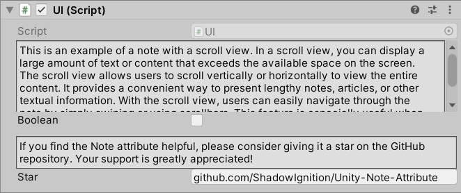

# Note Attribute

The `NoteAttribute` is a custom attribute used for creating Inspector notes in Unity, helpful in streamlining design processes.



## Usage
To use the `NoteAttribute`, follow these steps:

1. Attach the `NoteAttribute` to a serialized field in a MonoBehaviour script or a ScriptableObject.
2. Provide the note description as a string parameter when creating an instance of the `NoteAttribute`.
3. Optionally, you can specify the line height for the note by providing a `uint` value as the second parameter. A value of 0 indicates auto-sizing.

In this example, the `NoteAttribute` is attached to the `myField` serialized field in the `MyScript` MonoBehaviour. The provided note description will be displayed in the Unity Inspector for the `myField` field.

```csharp
using UnityEngine;

public class MyScript : MonoBehaviour
{
    [Note("This is a note for the field.")]
    public int myField;

    [Note(3, "This is a note with a custom line height.")]
    public int myField;
}
```

4. Save your script and go back to the Unity Editor. Open the Inspector for the object that contains the script you just modified.

5. In the Inspector, you will now see a note above the associated field.

## Notes

- The `NoteAttribute` is purely for preview purposes in the Unity Inspector and does not affect the runtime behavior of your game or application.

- If you find the `NoteAttribute` helpful, please consider giving it a star on the GitHub repository. Your support is greatly appreciated!

## License

The `NoteAttribute` is provided as-is under the terms of the MIT License. Feel free to modify and adapt it to suit your needs.
